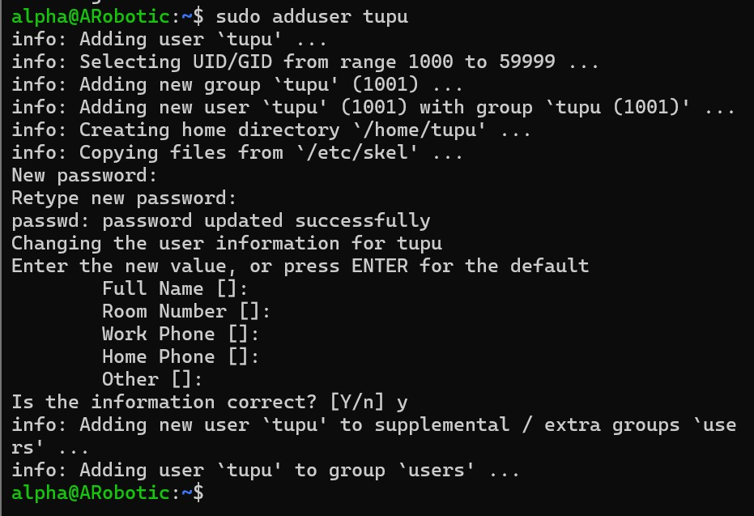

**Date:** 2025-02-22
**Author:** Aayush shrestha  (amk1006019@student.hamk.fi)

# Brief Description about Project:

- I created users tupu and lupu using sudo adduser tupu and sudo useradd -m -d /home/lupu -s /bin/bash -G supu lupu.Passwords were set with sudo passwd. For sudo access, I edited the sudoers file with sudo visudo and added tupu ALL=(ALL:ALL) ALL and lupu ALL=(ALL:ALL) ALL. Alternatively, I added them to the sudo group using sudo usermod -aG sudo tupu and sudo usermod -aG sudo lupu.

- Next, I set up a shared directory. I created /opt/projekti with sudo mkdir /opt/projekti, added tupu and lupu to the projekti group using sudo usermod -aG projekti tupu and sudo usermod -aG projekti lupu, changed ownership with sudo chown :projekti /opt/projekti, and set permissions with sudo chmod 770 /opt/projekti. The output of ls -ld /opt/projekti confirmed the setup: drwxrwx--- 2 root projekti 4096 Jan 30 21:45 /opt/projekti.

### Step 1: Create the Tupu User
        sudo adduser tupu

### Step 2: Create the Lupu User
        sudo adduser supu

### Step 3: Grant Sudo Privileges to Tupu and Lupu

#### 1. Enter the Command:
        sudo visudo

#### 2. Add the following lines at the end:
        tupu ALL=(ALL:ALL) ALL
        lupu ALL=(ALL:ALL) ALL

### Step 4: Create /opt/projekti and Set Up Proper Permissions

#### 1. Create the directory:
        sudo mkdir /opt/projekti

#### 2. Create a group (projekti) and add users to it:
        sudo groupadd projekti
        sudo usermod -aG projekti tupu
        sudo usermod -aG projekti lupu

#### 3. Change the group ownership of the directory:
        sudo chown :projekti /opt/projekti

#### 4. Set correct permissions:
        sudo chmod 770 /opt/projekti

#### 5. Ensure new files inherit the group (setgid bit):
        sudo chmod g+s /opt/projekti

### Step 5: Verification:

#### 1. Check users
        cat /etc/passwd | grep -E "tupu|lupu|hupu"

#### 2. Check group memberships
        groups tupu
        groups lupu

#### 3. Check /opt/projekti permissions
        ls -ld /opt/projekti

